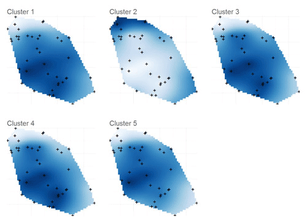
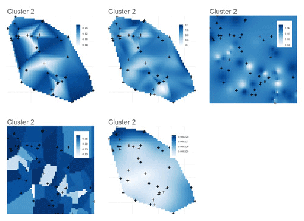
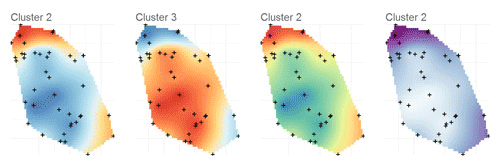
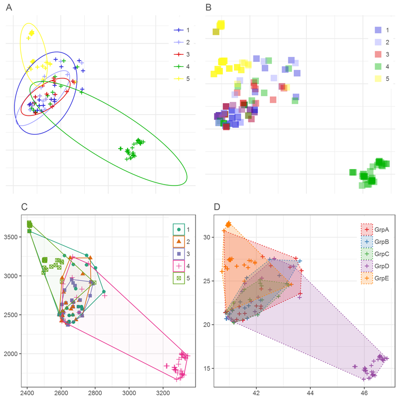

# pophelperSpatial 1.0.0

`pophelperSpatial` is an R package that incorporates spatial/geographic data with qlist or q-matrices such as ADMIXTURE, fastSTRUCTURE, STRUCTURE, TESS etc.  

For a detailed demonstration and walkthrough, refer the online [vignette](http://royfrancis.github.io/pophelperSpatial/).  

## Installation  
You need to have R (> 3.3.2) statistical package installed on your system. [R](https://www.r-project.org/) is open-source and freely available to download for Windows, Mac and other OS. Then, install the 'devtools' package and other dependencies.  

```coffee
# install packages from CRAN
install.packages(c("akima","Cairo","devtools","fields","ggplot2","gridExtra","gtable","PBSmapping","spatstat","tidyr"),dependencies=T)
```

Then, you can install `pophelperSpatial` and `pophelper` from `github` using the `devtools` package. `pophelper` package is needed to read in various run files.

```coffee
#install from GitHub
install_github('royfrancis/pophelper')
install_github('royfrancis/pophelperSpatial')
```

Note that `ggplot2` version must be 2.2.0 or higher. And `pophelper` version must be 2.0.0 or higher. Then load both libraries as below.

```coffee
#load library for use
library(pophelper)
library(pophelperSpatial)
```

`pophelperSpatial 1.0.0` has been tested on  

+ Windows 10 64bit, R 3.3.2  
+ Windows 7 64bit, R 3.3.2  
+ Ubuntu Linux 16.04.1 LTS 64bit, R 3.3.2  
+ Scientific Linux 6.8 (Carbon) 64bit, R 3.3.1  

## Functions

For help on any function, use `?plotQInterpolate`. If inside RStudio press TAB inside a function to view arguments. `plotQSpatial(<tab>)`.  
 
```coffee
plotQInterpolate()     # Spatially interpolate clusters from a STRUCTURE/TESS run file
plotQSpatial()         # Cluster by max assignment and plot points spatially
```  

  

__Fig. 1:__ *Interpolated plot of a one-element qlist containing 6 clusters (K=6). The default interpolation algorithm (method) used was kriging. In this particular case, it is known that K=2, therefore only cluster 2 has useful information.*  

  

__Fig. 2:__ *Interpolated plot of one cluster (Cluster 2) containing 6 clusters (K=6) showing different interpolation methods. Row 1 from left: bilinear, bicubic and Inverse distance weighting. Row 2 from left: Nearest neighbour and Kriging.*  

  

__Fig. 3:__ *Interpolation plots showing some of the available colour palettes.*  

  

__Fig. 4:__ *Some of the plots created using the function `plotQSpatial()`.*  

For detailed demonstration and description, refer the [vignette](http://royfrancis.github.io/pophelperSpatial/).  

## Disclaimer  

The `pophelperSpatial` R package is offered free and without warranty of any kind, either expressed or implied. I will not be held liable to you for any damage arising out of the use, modification or inability to use this program. `pophelperSpatial` R package can be used, redistributed and/or modified freely for non-commercial purposes subject to the original source being properly cited. Licensed under GPL-3. Please make sure you verify all your results.  

## Contact  

If you have any comments, suggestions or issues, report on the [Github issues page](https://github.com/royfrancis/pophelperSpatial/issues).  

2016 Roy M Francis  
